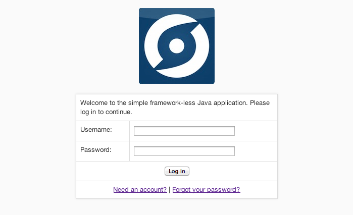

Java Frameworkless
===============================

A framework-free Java implementation of Stormpath's Java SDK with a simple web application.

### Prelude

This demonstrative implementation has been written as a starting point for any Java web developers who are looking to implement [Stormpath](http://www.stormpath.com) in Java environment. 

Unlike our [existing sample applications](https://github.com/stormpath/stormpath-spring-samples), this one does not rely on Spring or Shiro, which makes it ideal for those who haven't worked with either of those frameworks or want a smaller bootstrap to start with.

The following capabilities have been implemented:

* Account creation
* Authentication
* Password Reset
* Sinatra-centric, modular protected resource structure

### Assumptions

This readme assumes that you have already set up a developer account with Stormpath and know how to retrieve your API key and your application URL. If you don't know how to do this, refer to [Stormpath's REST Quickstart Guide](http://www.stormpath.com/docs/java/quickstart)

### Screenshot

### Set up Instructions

1. Clone the repository to your local machine.
2. Navigate to the cloned directory via the command line.
3. Run `maven install` to install the dependencies.
4. Configure the "included application.properties" file

5. Configure the password reset page on your directory within the [Stormpath API Console](http://api.stormpath.com) to use the following URL for its Password Reset workflow (Directory > Workflows > Password Reset show link):

		localhost:9292/reset.jsp

6. Run the app locally by clicking the "build and run" button in your IDE.

### Dependencies

This impl relies on the following, which can all be installed from Rubygems.org using `gem install` individually or by via `bundle`. 

* Stormpath Java SDK
* javax.servlet.*

### Disclosure

Code provided as-is. No warranty, not guaranteed by anyone for anything other than being an example.
